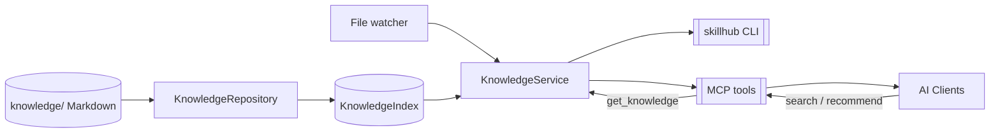

# SkillHub

> Generated by [readme-generate](https://github.com/agenvoy/skill-readme-generate) · 中文版见 [doc/README.zh.md](doc/README.zh.md)

***

  <strong>The Git-backed knowledge engine for AI agent skills.</strong>

***

> Keep every Markdown skill in a Git repository, index it once, and let Claude Code, Trae, Codex, Cursor or any MCP client search first and load only what it needs — so a growing skill library never blows up the context window.

> **Note:** SkillHub content is only visible when actively searched — agents never browse your skill library on their own. For Trae, install the bundled **skillhub-router** skill (`.trae/skills/skillhub-router`) so every task searches the knowledge base first; all other clients just call `search_knowledge` / `recommend_knowledge` before `get_knowledge`.

## Table of Contents

- [Features](#features)

- [Architecture](#architecture)

- [License](#license)

- [Author](#author)

## Features

> Install with `uv sync` · Full documentation in [doc/doc.md](doc/doc.md)

- **Git as the knowledge base** — a repository of Markdown is the single source of truth; the index rebuilds any time and changes stay reviewable and revertible.

- **Auto-refresh on change** — a file watcher plus read-time fingerprint checks keep every process in sync; `git pull` needs no restart.

- **Search-first, load-on-demand** — retrieval returns compact candidates only; full content and sub-resources are fetched only when a skill is selected.

- **Bilingual retrieval** — English token search and Chinese character/bigram search with type and tag filters.

- **One engine, many shapes** — stdio servers launched by each client, or one shared HTTP server on your LAN or behind a reverse proxy.

## Architecture

> Full architecture in [doc/architecture.md](doc/architecture.md)

## License

This project is licensed under the [MIT License](LICENSE).

## Author

<h4 style="padding-top: 0">阿柴</h4>

<a href="mailto:2480419172@qq.com"><2480419172@qq.com></a> <a href="https://github.com/2423560192"><https://github.com/2423560192></a>

***

© 2026 [阿柴](https://github.com/2423560192)
