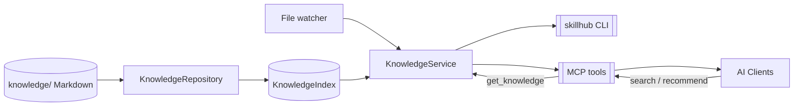

# SkillHub

> [!NOTE]
> 此 README 由 [readme-generate](https://github.com/agenvoy/skill-readme-generate) 生成，英文版請參閱 [../README.md](../README.md)。

***

<p align="center">
  <strong>把技能管进 Git 的 AI Agent 知识引擎。</strong>
</p>

<p align="center">
<a href="../LICENSE"></a>
<a href="https://docs.astral.sh/uv/"></a>
<a href="https://modelcontextprotocol.io"></a>
<a href="https://github.com/2423560192/context-hub"></a>
</p>

***

> 把每个 Markdown 技能收进 Git 仓库统一建索引，让 Claude Code、Trae、Codex、Cursor 等任意 MCP 客户端先检索、再按需加载——技能库再大，也不会撑爆上下文。

> **提示：** SkillHub 的内容要**主动检索**才可见——Agent 不会自动翻你的技能库。Trae 用户请安装仓库自带的 **skillhub-router 路由技能**（`.trae/skills/skillhub-router`），让每个任务先搜知识库；其余客户端遵循先 `search_knowledge` / `recommend_knowledge`、再 `get_knowledge` 的流程即可。

## 目录

- [功能特点](#功能特点)
- [使用](#使用)
- [架构](#架构)
- [授权](#授权)
- [作者](#作者)

## 功能特点

> 安装：`uv sync` · 完整文档见 [doc.zh.md](doc.zh.md)

- **Git 即知识库** — 一个仓库的 Markdown 就是唯一事实来源，索引可随时重建，改动可审查、可回滚。
- **改动自动生效** — 文件监听 + 读取时指纹校验，`git pull` 后无需重启服务。
- **先检索再加载** — 检索只返回紧凑候选，命中才取正文；技能子资源有清单，需要时再单独取。
- **中英双语检索** — 英文 token 与中文单字/双字检索，支持类型与标签过滤。
- **一份引擎多种形态** — 可被各客户端以 stdio 拉起，也可常驻共享 HTTP 供局域网或反代后共用。

## 使用

从零开始约 3 分钟：

```bash
git clone <你的引擎仓库地址> context-hub
cd context-hub
uv sync                                   # 安装（唯一依赖 uv）
uv run skillhub-mcp --repo . --transport streamable-http --port 8765
```

服务地址即 `http://127.0.0.1:8765/mcp`。给任意 AI 客户端添加 MCP 服务器并填同一个地址：

```json
{ "mcpServers": { "skillhub": { "type": "http", "url": "http://127.0.0.1:8765/mcp" } } }
```

技能放在 `knowledge/skills/{技能名}/SKILL.md`（目录名就是技能 id；引擎自带分类骨架可直接放，也可把 `--repo` 指向你自己的知识库仓库）。让 Agent 先 `search_knowledge` 检索、再对最佳命中的 id 调 `get_knowledge(id)`——技能只有被主动检索到才会可见。

各客户端接入（Claude Code / Codex / Cursor / Trae）、CLI 与 MCP 工具完整参考、Windows 自启与 FAQ：见 [doc.zh.md](doc.zh.md)。技能格式规范：[../docs/content-format.md](../docs/content-format.md)。无人值守场景下，仓库自带看门狗（计划任务、无弹窗）可在服务掉线后 2 分钟内自动拉起。

## 架构

> 完整架构见 [architecture.zh.md](architecture.zh.md)



## 授权

本项目采用 [MIT License](../LICENSE)。

## 作者


<h4 style="padding-top: 0">阿柴</h4>

<a href="mailto:2480419172@qq.com">2480419172@qq.com</a><br>
<a href="https://github.com/2423560192">https://github.com/2423560192</a>

***

© 2026 [阿柴](https://github.com/2423560192)
