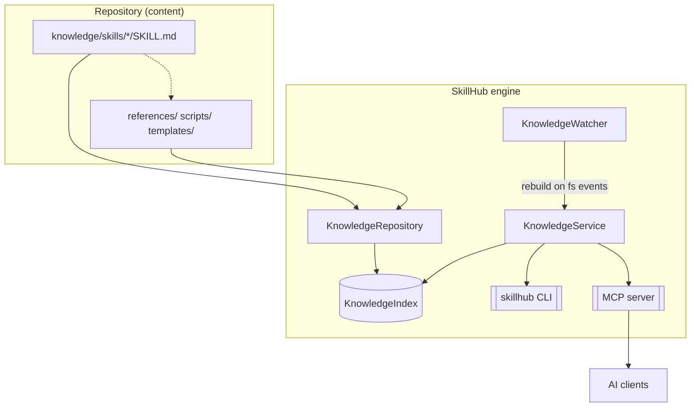
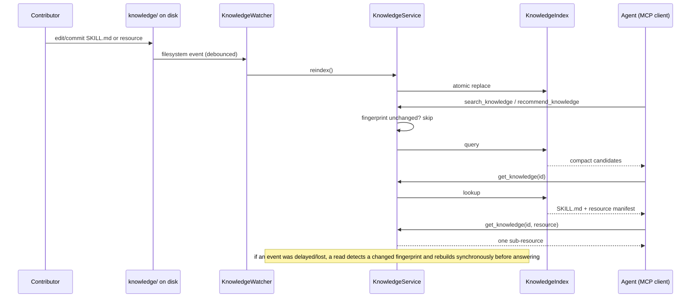

# SkillHub — Architecture

> Generated by [readme-generate](https://github.com/agenvoy/skill-readme-generate) · 简体中文版 [architecture.zh.md](architecture.zh.md)

## Components

**KnowledgeRepository** is the source adapter. It treats `knowledge/skills/{skill-name}/SKILL.md` as a packaged skill entry point, records optional `references/`, `scripts/`, and `templates/`, and keeps the original single-file parser for the other knowledge types (`prompt`, `workflow`, `template`, `rule`). It validates YAML, skill fields, package names, referenced resources, and duplicate IDs. It never mutates source files.

**KnowledgeIndex** is a thread-safe, replace-on-rebuild in-memory index. A rebuild constructs all maps off-lock and swaps them atomically, so MCP readers never observe a partial index. Ranking is deterministic lexical relevance with field weights and Chinese character/bigram tokenization.

**KnowledgeService** owns freshness and application behavior. It is the only layer used by the CLI and MCP adapters. Before every query it compares a cheap file fingerprint (path + mtime + size) and rebuilds when anything changed.

**KnowledgeWatcher** observes filesystem events under `knowledge/` — including scripts and templates — and debounces bursts from editors (0.15 s). It provides proactive refresh; the service fingerprint check is the correctness fallback.

**mcp_server** exposes four stable tools through the official MCP Python SDK. **cli** exposes local operator commands. Neither layer contains parsing or ranking logic.

## Request and data flow

## Concurrency and failure model

- Index replacement and reads are guarded by a reentrant lock; a rebuild swaps complete structures in one step.
- Validation errors exclude only the invalid document. Valid documents remain queryable; errors are reported by `validate` and `status`.
- Duplicate IDs keep the first path in deterministic sort order and report the later path as invalid.
- The MCP server writes diagnostics to stderr; stdout is reserved for MCP stdio framing.
- HTTP mode binds to loopback by default and does not claim production authentication.

## Extension points

- Replace or compose `KnowledgeIndex` for vector/hybrid retrieval.
- Add a Git write service and Web API without giving write capability to MCP tools.
- Add repository revision metadata or remote synchronization without changing document IDs.
- Add a persistent derived cache only when startup profiling justifies it.
