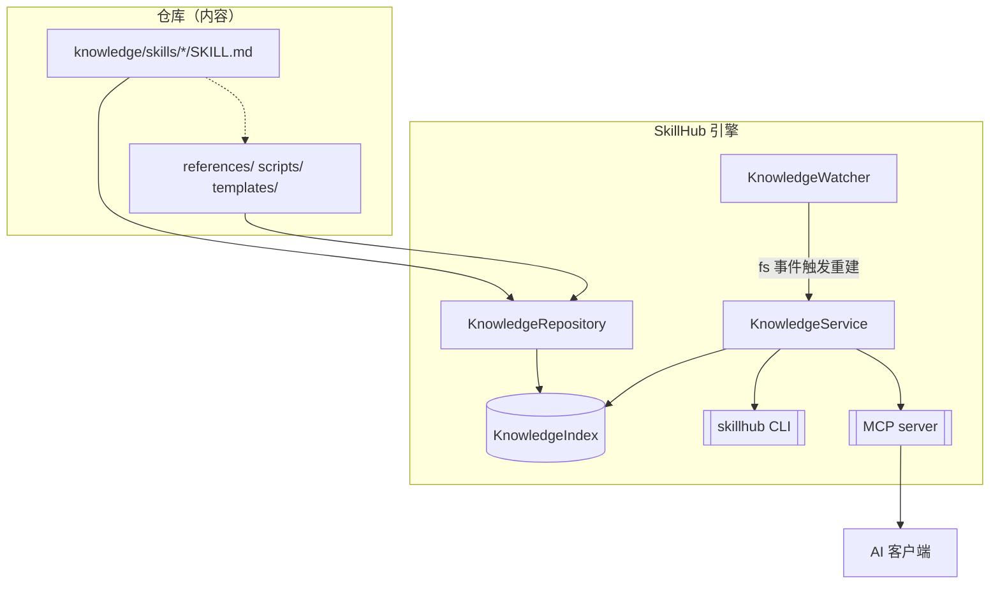
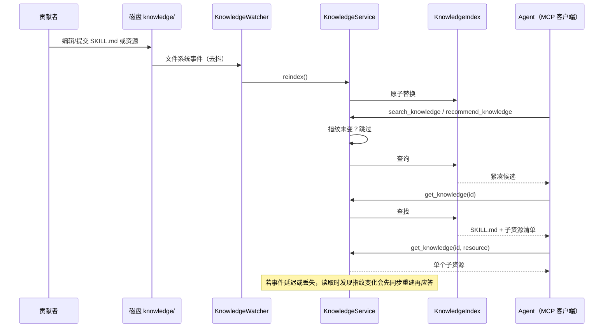

# SkillHub — 架构

> 由 [readme-generate](https://github.com/agenvoy/skill-readme-generate) 生成 · English: [architecture.md](architecture.md)

## 组件

**KnowledgeRepository** 是内容适配层：把 `knowledge/skills/{skill-name}/SKILL.md` 视为技能包入口，记录可选的 `references/`、`scripts/`、`templates/`，同时保留其它类型（`prompt`、`workflow`、`template`、`rule`）的单文件解析器。它校验 YAML、技能字段、包名、引用的资源与重复 ID，且从不改动源文件。

**KnowledgeIndex** 是线程安全、重建即整体替换的内存索引。重建在锁外构建全部结构后原子替换，MCP 读取方永远不会看到半成品索引。排序为确定性的词法相关，带字段权重与中文单字/双字切分。

**KnowledgeService** 负责新鲜度与应用行为，是 CLI 与 MCP 适配层唯一使用的层。每次查询前用廉价指纹（路径+mtime+大小）比对，有变化即重建。

**KnowledgeWatcher** 监听 `knowledge/` 下的文件系统事件（含脚本与模板），对编辑器突发写入做 0.15 秒去抖。它提供主动刷新；服务指纹校验是正确性兜底。

**mcp_server** 通过官方 MCP Python SDK 暴露四个稳定工具；**cli** 暴露本地运维命令。两层都不含解析或排序逻辑。

## 数据与请求流

## 并发与失败模型

- 索引替换与读取由可重入锁保护；重建一次性换入完整结构。
- 校验错误只排除该篇文档；其余有效知识保持可查，错误由 `validate`/`status` 报告。
- 重复 ID 保留确定性排序下的首个路径，并将后出现的路径报为无效。
- MCP 服务把诊断写到 stderr；stdout 留给 MCP stdio 帧协议。
- HTTP 模式默认只绑回环地址，不宣称生产级鉴权。

## 扩展点

- 替换或组合 `KnowledgeIndex` 以接入向量/混合检索。
- 增加 Git 写入服务与 Web API，但绝不给 MCP 工具写权限。
- 在不改变文档 ID 的前提下增加仓库版本元数据或远端同步。
- 仅在启动性能分析证明有必要时，再加持久化派生缓存。
