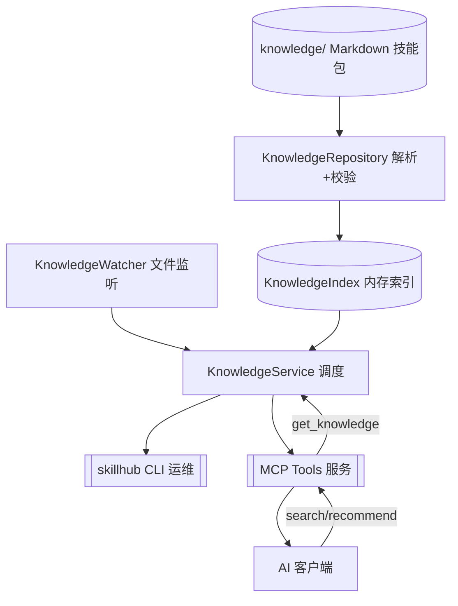
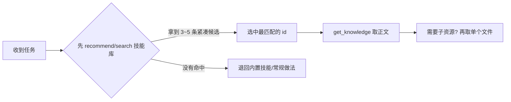

# 多个 Agent 各装各的技能？SkillHub：一份技能库，所有 Agent 统一调用

> AI 应用开发 · 开源项目推介 · MCP

[](https://github.com/2423560192/context-hub)
[](https://github.com/2423560192/context-hub/blob/master/LICENSE)
[](https://docs.astral.sh/uv/)
[](https://modelcontextprotocol.io)

[TOC]

## 一、先说痛点：工具越来越多，技能却"各自为政"

重度 AI 编程用户基本都同时装了好几个"Agent"：Claude Code、Trae、Codex、Cursor……它们各有所长，但**每个工具都有自己的一套"塞技能"的方式**：

- Cursor 用 Rules，Codex 用 AGENTS.md，Claude Code 有自己的 Skills，Trae 又有自己的技能目录/插件；
- 于是"代码审查规范""PRD 写作流程""发布清单"这类通用技能，你得**在每个工具里各写一份**，格式还不互通；
- 改一条规范，要跑到 N 个地方同步，漏改一处，下次这个 Agent 就按旧规矩办事；
- 更别说跨项目、跨机器、跨同事复制了——拷来拷去，版本早就漂移了。

**你维护的不是一套技能库，而是 N 套互相孤立的技能库。** 技能越多、工具越多，这个问题越严重。

能不能把技能从"每个工具"里抽出来，**只维护一份，让所有 Agent 按需调用**？

这就是我最近开源的项目 **SkillHub** 想解决的问题。

## 二、SkillHub 是什么？

一句话：**SkillHub 是一个基于 Git 的 AI 技能中心引擎**——把 Markdown 技能包统一收进一个 Git 仓库管理，通过标准 MCP 协议对外提供服务，Claude Code / Trae / Codex / Cursor 等**任意 MCP 客户端**接入同一个技能库，先检索、再按需加载。

```text
你的技能库(Git 仓库 + Markdown，全项目唯一)
        │
        ▼
   SkillHub 引擎（建索引 + 文件监听）
        │
        ▼
   MCP 工具（search / recommend / get / list）
        │
        ▼
 Claude Code / Trae / Codex / Cursor ... 共用同一份技能
```

项目地址：[github.com/2423560192/context-hub](https://github.com/2423560192/context-hub)（MIT 协议，欢迎 Star ⭐）

### 为什么它能"一份管所有"？

- **技能与 Agent 解耦**：技能只活在 Git 仓库里，不再绑定任何工具的私有格式——你改的是 Markdown，不是某个软件的配置文件；
- **标准协议接入**：走 MCP 这一个标准，接一次 Claude Code 的配置，照抄就能接 Codex / Cursor / Trae，配置模板仓库里都备好了；
- **一个服务多处共用**：本机起一个共享 HTTP 服务，几个工具、几个项目、甚至局域网里的同事，都连同一个地址；
- **Markdown 是唯一事实来源**：无数据库、无私有格式，`git diff` 能看改了什么、`git revert` 能回滚，团队协作天然成立。

## 三、接入长什么样：一条命令，四家客户端连同一个技能库

先起一个共享服务（唯一依赖是 [uv](https://docs.astral.sh/uv/)）：

```bash
git clone https://github.com/2423560192/context-hub.git
cd context-hub
uv sync
uv run skillhub-mcp --repo . --transport streamable-http --port 8765
```

然后给每个客户端加同一个 MCP 地址：

```json
{ "mcpServers": { "skillhub": { "type": "http", "url": "http://127.0.0.1:8765/mcp" } } }
```

- **Claude Code / Cursor**：分别写入项目 `.mcp.json` / `.cursor/mcp.json`；
- **Trae**：设置 → MCP → 添加 HTTP；
- **Codex**：写进 Codex 的 MCP 配置（TOML）；
- 想各客户端独立拉起、不走 HTTP 的 stdio 写法，以及上述全部现成模板，都在仓库 `examples/mcp/` 里，照抄即可。

**效果就是标题那句话**：技能只在 `knowledge/` 里维护一份，Claude Code、Trae、Codex、Cursor……谁用都是同一份最新版；改一处、commit 一次，所有 Agent 下次检索即是新口径。

> ⚠️ 注意：技能要**主动检索**才可见，Agent 不会自己翻技能库。Trae 用户建议装仓库自带的 `skillhub-router` 路由技能（`.trae/skills/skillhub-router`），让它每个任务先搜知识库再干活；其余客户端遵循"先 `search_knowledge` / `recommend_knowledge`、再 `get_knowledge`"的流程即可。

## 四、架构长什么样？

引擎分五层，各干各的，没有任何一个模块在摸鱼：



- **KnowledgeRepository**：负责解析技能包、校验 YAML/front matter/资源引用；
- **KnowledgeIndex**：内存索引，**重建即整体替换**，读者永远看不到半成品；
- **KnowledgeService**：每次查询前做一次廉价"文件指纹"比对，变了就自动重建；
- **KnowledgeWatcher**：监听 `knowledge/` 下任何文件改动，`git pull` 后无需重启；
- **mcp_server / cli**：只做协议与命令适配，不含任何业务逻辑。

## 五、顺带解决了"上下文塞爆"：先检索，再加载

技能统一了，但总不能每个任务把几百个技能全文都发给 Agent——那不叫复用，叫灾难。SkillHub 只暴露 4 个 MCP 工具，Agent 的调用习惯是"先搜再取"：



| 工具 | 干什么 | 返回正文 |
| --- | --- | --- |
| `search_knowledge(query, types?, tags?, limit?)` | 关键词搜索 | 否，紧凑候选 |
| `recommend_knowledge(task, types?, tags?, limit?)` | 按任务描述推荐 | 否，紧凑候选 |
| `list_knowledge(type?, tags?, offset?, limit?)` | 分页浏览目录 | 否 |
| `get_knowledge(id, resource?)` | 取单篇完整正文 / 技能子资源 | 是 |

**"候选"和"全文"分离**：检索开销小、命中精准，Agent 只在决定使用某技能时才消耗上下文——技能库再大，日常任务一个字都不占。

## 六、它和"每个 Agent 各装各的"有什么区别？

| 对比项 | 现状：每个 Agent 各装各的 | SkillHub：统一技能库 |
| --- | --- | --- |
| 技能放哪 | 散落各工具的私有格式，一份规范 N 份拷贝 | Git 仓库里一份 Markdown，全项目唯一 |
| 改一条规范 | 跑到 N 个地方同步，漏一处口径就漂移 | 只改一处、commit 一次，全部 Agent 即取即新 |
| 跨工具复用 | 格式不互通，基本不可能 | 标准 MCP，Claude/Trae/Codex/Cursor 都接同一服务 |
| 团队/多项目共享 | 拷贝分发，版本失控 | 一个共享 HTTP 服务，全员同库 |
| 冷门技能可用性 | 没地方塞，等于没有 | 检索即可命中 |
| 上下文占用 | 想全塞必然爆，取舍即损失 | 平时≈0，用时按需取全文 |

## 七、3 分钟跑起来（实测可复制）

刚才第一节的共享服务已经起好了，现在放进第一个技能试试（目录名就是技能 id）：

```bash
# 技能就放在 knowledge/skills/ 下，比如：
# knowledge/skills/demo/SKILL.md
```

技能 `SKILL.md` 长这样（**可以整段复制**）：

```markdown
---
description: 一句话说明本技能的能力与触发场景。
description_zh: 简短中文介绍。
description_en: Short English introduction.
version: 1.0.0
author: 你的名字
---
正文写要注入给 Agent 的指令；需要附加资料就放进 references/ scripts/ templates/，
再在正文里按 @references/文件名 引用（引擎会校验文件必须真实存在）。
```

验证是否连通，直接问你的 Agent：

```text
调用 search_knowledge 搜一下 "demo"，把命中的 id 告诉我
```

能返回结果就说明通了。也可以用命令行冒烟：

```bash
uv run python scripts/smoke_http.py --query demo
```

## 八、适合谁用？

- **同时用两个以上 AI 编程工具的重度用户**：受够了同一份规范在 Claude/Cursor/Trae 里各写一遍；
- **多 Agent / 多项目用户**：代码审查、PRD、发布流程这些通用技能，希望全项目只有一份、随时最新；
- **团队/公司**：把规范、模板、内部流程沉淀成一个技能库，起一个共享服务大家用，新人连环境都不用手动配；
- **提示词工程师**：技能即文档，从"给每个工具写提示词"升级到"维护一份统一知识库"；
- **喜欢 Git 工作流的人**：改动可审查、可回滚，天然适合协作。

## 九、进阶玩法（文档都备好了）

- 详细部署：个人本机常驻 / 局域网共用 / 公网 + 反向代理（当前为 MVP，公网请自备鉴权）；
- Windows 开机自启：登录即后台启动，所有客户端零配置直连（现成脚本 `scripts/start-skillhub-mcp.bat`）；
- 技能格式规范：支持多级/中文分类目录，目录名自动成为可检索 tag；
- 完整 CLI：`validate` / `search` / `status` / `reindex`，一条命令自查知识库健康度。

仓库内 `doc/` 与 `docs/` 有**中英双语**的完整文档（README、详细技术文档、架构文档、内容格式规范），上手成本极低。

## 十、写在最后

如果你也受够了"Agent 越多、技能越乱、改了这头漏那头"，欢迎试试 SkillHub——**一份技能库，所有 Agent 统一调用**：

- ⭐ 给个 Star：[github.com/2423560192/context-hub](https://github.com/2423560192/context-hub)
- 🐛 遇到问题提 Issue，觉得好用也欢迎提 PR；
- 技术细节可看仓库双语文档，架构与格式说明都在里面。

> 开源不易，如果这篇文章帮到你，点赞、收藏、转发三连就是对我最大的支持！有任何疑问欢迎评论区交流～

---

<!-- 发布小贴士（发布前删除本块）：
1. 封面图可在 CSDN 编辑器的"文章封面"上传仓库 logo 或自绘架构图；
2. 本文 Mermaid 图在 CSDN Markdown 编辑器可直接渲染；如个别图不显示，
   可改用仓库 README 中的同款结构图并截图上传；
3. 正文中 github 链接请保持与你的仓库地址一致。
-->
